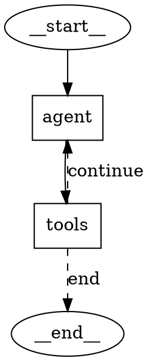

# Graph Visualization

Synapse provides multiple ways to visualize a compiled graph, from text-based formats suitable for terminals and documentation to image formats for presentations and debugging.

## Mermaid Diagram

Generate a [Mermaid](https://mermaid.js.org/) flowchart string. This is ideal for embedding in Markdown documents and GitHub READMEs:

```rust
let mermaid = graph.draw_mermaid();
println!("{mermaid}");
```

Example output:

```
graph TD
    __start__(["__start__"])
    agent["agent"]
    tools["tools"]
    __end__(["__end__"])
    __start__ --> agent
    agent --> tools
    tools -.-> |continue| agent
    tools -.-> |end| __end__
```

- `__start__` and `__end__` are rendered as rounded nodes.
- User-defined nodes are rendered as rectangles.
- Fixed edges use solid arrows (`-->`).
- Conditional edges with a path map use dashed arrows (`-.->`) with labels.

## ASCII Art

Generate a simple text summary for terminal output:

```rust
let ascii = graph.draw_ascii();
println!("{ascii}");
```

Example output:

```
Graph:
  Nodes: agent, tools
  Entry: __start__ -> agent
  Edges:
    agent -> tools
    tools -> __end__ | agent  [conditional]
```

The `Display` trait is also implemented, so you can use `println!("{graph}")` directly, which outputs the ASCII representation.

## DOT Format (Graphviz)

Generate a [Graphviz DOT](https://graphviz.org/) string for use with the `dot` command-line tool:

```rust
let dot = graph.draw_dot();
println!("{dot}");
```

Example output:



## PNG via Graphviz

Render the graph to a PNG image using the Graphviz `dot` command. This requires `dot` to be installed and available in your `$PATH`:

```rust
graph.draw_png("my_graph.png")?;
```

Under the hood, this pipes the DOT output through `dot -Tpng` and writes the resulting image to the specified path.

## PNG via Mermaid.ink API

Render the graph to a PNG image using the [mermaid.ink](https://mermaid.ink/) web service. This requires internet access but does not require any local tools:

```rust
graph.draw_mermaid_png("graph_mermaid.png").await?;
```

The Mermaid text is base64-encoded and sent to `https://mermaid.ink/img/{encoded}`. The returned image is saved to the specified path.

## SVG via Mermaid.ink API

Similarly, you can generate an SVG instead:

```rust
graph.draw_mermaid_svg("graph_mermaid.svg").await?;
```

## Summary

| Method | Format | Requires |
|--------|--------|----------|
| `draw_mermaid()` | Mermaid text | Nothing |
| `draw_ascii()` | Plain text | Nothing |
| `draw_dot()` | DOT text | Nothing |
| `draw_png(path)` | PNG image | Graphviz `dot` in PATH |
| `draw_mermaid_png(path)` | PNG image | Internet access |
| `draw_mermaid_svg(path)` | SVG image | Internet access |
| `Display` trait | Plain text | Nothing |

## Tips

- Use `draw_mermaid()` for documentation that renders on GitHub or mdBook.
- Use `draw_ascii()` or `Display` for quick debugging in the terminal.
- Conditional edges without a `path_map` cannot show their targets in visualizations. If you want full visualization support, use `add_conditional_edges_with_path_map()` instead of `add_conditional_edges()`.
